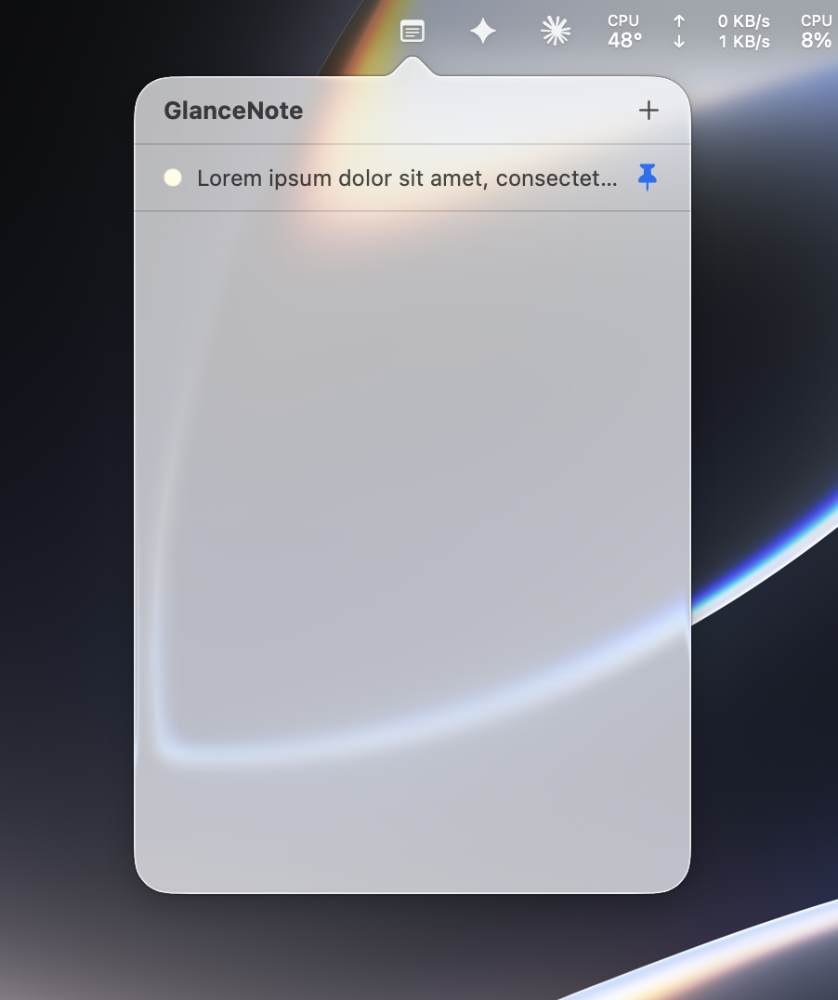
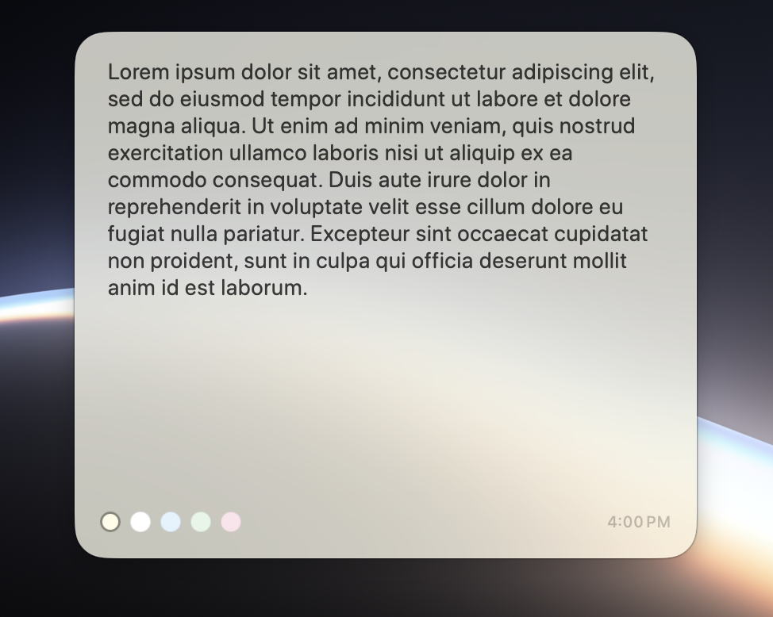

# GlanceNote

A widget-first sticky note application for macOS and iOS. Each note lives in a frameless, always-on-top `NSPanel` sized to match a WidgetKit system family — so the panel floating on your desktop is visually identical to the widget on your Home Screen.

The application runs exclusively from the menu bar (`LSUIElement = YES`). There is no Dock icon and no entry in the application switcher.

---

## UI Overview

| Menu Bar Popover | Frameless Floating Note Panel |
| :---: | :---: |
|  |  |

---

## Features

- **LSUIElement architecture** — the application activates only transiently when a panel or popover receives focus; no persistent Dock presence or main window
- **Frameless floating panels** — borderless `NSPanel` windows at `.floating` window level, visible across all Spaces via `.canJoinAllSpaces`
- **Widget visual parity** — default panel dimensions are pinned to WidgetKit system family footprints: small 155×155, medium 329×155, large 329×345
- **Edge-drag resize** — custom `ResizeHandleView` strips at all four edges handle the full drag lifecycle; S / M / L preset buttons in the toolbar snap back to widget dimensions
- **AppKit hit-test isolation** — a four-layer event-routing system (`NotePanel.mouseDown`, `PanelContainerView.hitTest`, `ResizeHandleView` mouse handlers, inset SwiftUI hover detector) prevents AppKit's internal resize machinery from engaging in parallel with the custom resize path
- **Color tags** — five background tints (yellow, white, blue, green, pink) composited over an `NSVisualEffectView` frosted-glass material
- **Debounced auto-save** — edits commit 500 ms after the last keystroke via SwiftUI's `task(id:)` cancellation mechanism; a synchronous save fires on panel close to prevent data loss
- **Session restore** — pinned panels reopen at their saved position and size on next launch via per-note `NSWindow` frame autosave keys
- **WidgetKit integration** — notes promoted to a widget slot are written to a shared App Group `UserDefaults` store and trigger an immediate `WidgetCenter` timeline reload on every save
- **iOS companion** — full note list and editor sharing the same `NoteCardView` and `SwiftData` schema as the macOS target

---

## Requirements

| | Minimum |
|---|---|
| macOS | 14.0 Sonoma |
| iOS | 17.0 |
| Xcode | 15.0 |
| Swift | 5.9 |

A free Apple ID is sufficient for local development. The `ModelContainer` factory resolves the store path from the App Group container when available and falls back to `~/Library/Application Support/GlanceNote/` for Personal Team builds where App Group provisioning is unavailable. Widget data sharing and cross-target store access require a paid Apple Developer Program membership with an App Group entitlement.

---

## Project Structure

```
GlanceNote/
├── GlanceNote/
│   ├── App/
│   │   └── GlanceNoteApp.swift       # Entry point; AppDelegate; pinned-panel restore
│   ├── Model/
│   │   └── Note.swift                # SwiftData schema; ModelContainer factory
│   ├── Shared/
│   │   └── NoteCardView.swift        # Core note surface — macOS panel, iOS sheet, widget preview
│   ├── macOS/
│   │   ├── MenuBarController.swift   # NSStatusItem; note-list popover
│   │   ├── NotePanel.swift           # NSPanel subclass; ResizeHandleView; PanelContainerView
│   │   └── PanelRegistry.swift       # UUID → NotePanelController registry; open / close / restore
│   ├── iOS/
│   │   └── iOSRootView.swift         # NavigationStack root; note list and editor
│   └── Resources/
│       ├── Info.plist                # LSUIElement = YES
│       ├── GlanceNote.entitlements
│       ├── popover_view.png          # Screenshot — menu bar popover
│       └── floating_panel.png        # Screenshot — floating note panel
├── GlanceNoteWidget/
│   └── GlanceNoteWidget.swift        # TimelineProvider; systemSmall / Medium / Large families
├── SharedKit/
│   └── SharedDataClient.swift        # App Group UserDefaults bridge; NoteSnapshot; NoteColor
├── ARCHITECTURE.md                   # Full subsystem design document
└── CHANGELOG.md                      # Revision history
```

---

## Architecture

### Data flow

```
Note (SwiftData)
    │  commitSave() — debounced 500 ms, immediate on color change or disappear
    ▼
SharedDataClient.write(snapshots:)
    │  JSON-encodes top-N NoteSnapshot values to UserDefaults(suiteName:)
    │  calls WidgetCenter.shared.reloadAllTimelines()
    ▼
GlanceNoteWidget — TimelineProvider
    │  reads NoteSnapshot array from shared UserDefaults
    ▼
Widget surface (Home Screen / Notification Center)
```

### macOS panel view hierarchy

```
NotePanel (NSPanel)
└── PanelContainerView              ← hit-test gate; routes edge events to handles
    ├── NSHostingView               ← SwiftUI tree: PanelChromeView → NoteCardView
    └── ResizeHandleView × 4       ← per-edge drag strips; own the full drag lifecycle
```

**AppKit hit-test isolation** is enforced through four coordinated layers:

| Layer | Location | Responsibility |
|---|---|---|
| 1 | `NotePanel.mouseDown(with:)` | Swallows edge-zone events that bypass hitTest due to floating-point rounding; forwards interior events to `super` so window dragging is unaffected |
| 2 | `PanelContainerView.hitTest(_:)` | Returns `ResizeHandleView` unconditionally for edge-zone hits; returns `nil` for unmatched edge points; normal result for interior |
| 3 | `ResizeHandleView` mouse handlers | `mouseDown`, `mouseDragged`, `mouseUp` each complete without calling `super`, preventing AppKit's `.resizable` subsystem from co-opting any part of the drag sequence |
| 4 | `PanelChromeView` hover detector | Inset by `edgeHandleThickness` (6 pt) so SwiftUI's `NSTrackingArea` never activates from edge-zone cursor movement |

See `ARCHITECTURE.md` for a complete breakdown of all subsystems including the SwiftData persistence stack, widget timeline strategy, and multi-instance panel model.

---

## Building

1. Open `GlanceNote.xcodeproj` in Xcode.
2. Select the `GlanceNote` scheme.
3. In **Signing & Capabilities**, set your development team on both the `GlanceNote` and `GlanceNoteWidget` targets.
4. Build and run (`Cmd+R`).

The application does not open any window on launch. Look for the note icon in the menu bar.

**To enable widget data sharing:** add an App Group identifier (`group.com.yourteam.glancenote`) to both targets under Signing & Capabilities, then update `AppGroup.suiteName` in `SharedKit/SharedDataClient.swift` to match.

**Gatekeeper (distribution builds):** if running a build not signed with a Developer ID, right-click the application bundle in Finder and select **Open** from the context menu to bypass the initial Gatekeeper quarantine prompt.

---

## License

MIT
